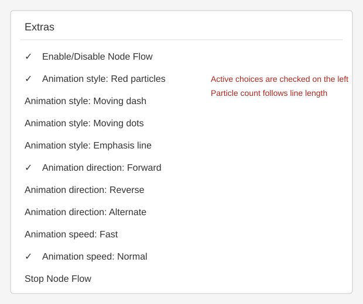

<div align="center">
  <h1>draw.io Node Flow Animation</h1>
  <p>Node-driven connector animation for draw.io</p>
  <p><a href="README.md">English</a> | <a href="README.zh-CN.md">中文</a></p>
</div>

---

An open-source draw.io plugin that animates outgoing connectors when a node is selected. It supports direct outgoing edges, Shift-click path mode, moving dash/dots/emphasis styles, and a line-preserving red-particle effect.

## Features

- Direct mode: click a node to animate its outgoing connectors.
- Path mode: Shift-click a node to animate all reachable downstream connectors.
- Four visual styles: moving dash, moving dots, emphasis line, and red particles.
- Red particles keep the connector unchanged and overlay a length-based number of red dots (2–12, about one per 100px).
- Forward, reverse, and alternating directions; fast, normal, and slow speeds.
- Native menu checkmarks show the active configuration.
- View-only animation: the mxGraph model and saved diagram are not modified.

## Install in draw.io Desktop

Start draw.io Desktop with `--enable-plugins`, load one of the files in `dist/`, then restart the application. Open **Extras → Node Flow Animation** to choose a style, direction, or speed.

## Distribution builds

| Build | Description |
| --- | --- |
| `dist/drawio-node-flow-auto.js` | Detects the system/editor language (recommended) |
| `dist/drawio-node-flow-zh.js` | Chinese menu labels |
| `dist/drawio-node-flow-en.js` | English menu labels |

Minified `.min.js` files are provided for each build. `drawio-node-flow.js` remains an alias of the auto-detect build for existing installations.
ZIP bundles are available in [`release/`](release/): [auto](release/drawio-node-flow-auto.zip), [中文](release/drawio-node-flow-zh.zip), and [English](release/drawio-node-flow-en.zip).

## Development

```text
npm test
npm run build
```

See [README.zh-CN.md](README.zh-CN.md), [docs/web-install.md](docs/web-install.md), and [docs/screenshots/](docs/screenshots/) for Chinese instructions and visual guides.



## License

MIT License. See [LICENSE](LICENSE).
