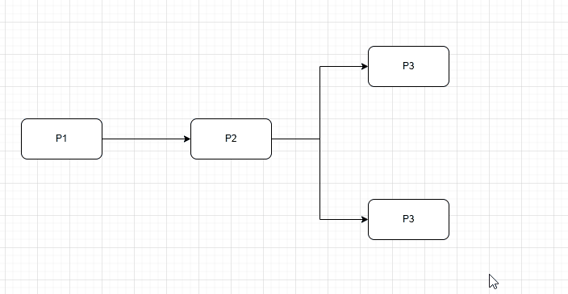
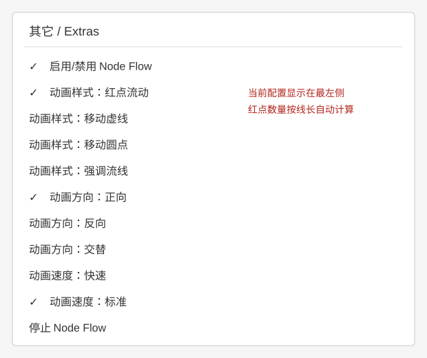

<div align="center">
  <h1>draw.io Node Flow Animation</h1>
  <p>面向 draw.io 的节点驱动连接线动画插件</p>
  <p><a href="README.md">English</a> | <a href="README.zh-CN.md">中文</a></p>
</div>

---

这是一个开源 draw.io 插件。选中节点后，插件会为该节点的出线添加动画；支持直接出线、Shift+点击下游路径，以及移动虚线、移动圆点、强调流线和红点流动效果。



## 功能

- 直接模式：点击节点，动画覆盖该节点的直接出线。
- 路径模式：按住 Shift 点击节点，动画覆盖所有可达的下游连接线。
- 四种样式：移动虚线、移动圆点、强调流线、红点流动。
- 红点流动保持连接线不变，按线长自动叠加红点数量（2–12 个，约每 100px 一个）。
- 红点动画周期会按连接线长度同比例调整，因此短线和长线上的像素移动速度保持一致。
- 支持正向、反向、交替，以及快速、标准、慢速。
- 菜单使用 draw.io 原生勾选标记显示当前配置。
- 动画只作用于 SVG 展示层，不修改 mxGraph model 和已保存图纸。

## 在 draw.io Desktop 中安装

使用 `--enable-plugins` 启动 draw.io Desktop，加载 `dist/` 中的任一版本，然后重启应用。打开 **其它 → Node Flow Animation**，即可选择样式、方向和速度。

## 三种发行版

| 文件 | 说明 |
| --- | --- |
| `dist/drawio-node-flow-auto.js` | 自动识别系统/编辑器语言（推荐） |
| `dist/drawio-node-flow-zh.js` | 固定中文菜单 |
| `dist/drawio-node-flow-en.js` | 固定英文菜单 |

每个版本都提供压缩版 `.min.js`。为兼容已有安装，`drawio-node-flow.js` 仍然是自动识别版的别名。
三个 ZIP 安装包位于 [`release/`](release/)： [自动识别版](release/drawio-node-flow-auto.zip)、[中文版](release/drawio-node-flow-zh.zip)、[英文版](release/drawio-node-flow-en.zip)。

## 开发

```text
npm test
npm run build
```

英文说明见 [README.md](README.md)，安装说明见 [docs/web-install.md](docs/web-install.md)，双语截图见 [docs/screenshots/](docs/screenshots/)。



## 许可证

MIT License，详见 [LICENSE](LICENSE)。
